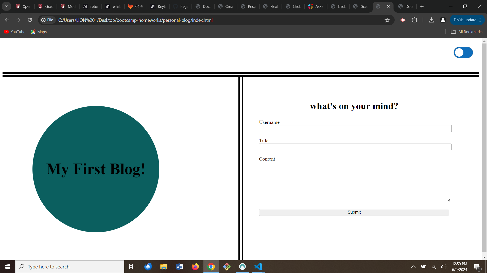

# Personal Blog

## Description

This is a two-page website where users can input and view blog posts.

## Installation

N/A

## Usage

On the first page the user may enter their username, the title of their post, and the blog content. Once the user clicks the "submit" button they will be redirected to a new page where their post will be displayed, along with any previous posts.

There is a toggle button located in the top-right corner of both pages that allows the user to select light or dark color mode for the webpage.

On the second page there is also a "back" button located at the top of the page that will redirect the user to the first page when it is clicked.

At the bottom of the second page there is a "Portfolio" link that, when clicked, will redirect the page to the blog creator's portfolio webpage.

Link: https://lisalreynolds.github.io/personal-blog/

